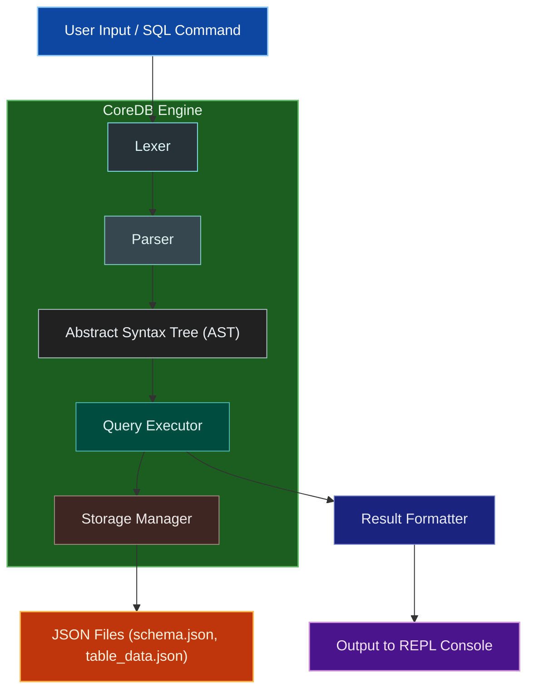

# DBMS Project Report  
## CoreDB – A Minimal SQL Database Engine  

---

## 1. Introduction

**CoreDB** is a minimal yet functional SQL Database Management System (DBMS) implemented entirely in Python. It provides a simplified SQL interface inspired by SQLite but is built from scratch without using any external database libraries.

This project is designed for educational purposes — to demonstrate how database systems parse, store, and execute SQL commands internally.

### Objectives
- Understand the internal architecture of a DBMS.  
- Implement a minimal SQL engine supporting essential database operations.  
- Explore schema management and persistent data storage using JSON.  
- Provide an interactive SQL shell for executing commands in real-time.  

---

## 2. Features

CoreDB offers the following core features:

- **SQL Parser:** Supports basic SQL statements such as `CREATE TABLE`, `INSERT`, `SELECT`, `UPDATE`, and `DELETE`.  
- **Storage Engine:** JSON-based data persistence system for tables and schemas.  
- **Query Executor:** Executes parsed SQL statements with `WHERE` conditions and `JOIN` operations.  
- **Interactive REPL:** Provides a command-line SQL shell with multiline query support.  
- **Type System:** Supports `INT`, `TEXT`, `FLOAT`, and `BOOLEAN` data types.  
- **Schema Management:** Manages table definitions, columns, constraints, and foreign keys.  
- **Foreign Key Constraints:** Enforces referential integrity between tables.  
- **JOIN Operations:** Supports `INNER`, `LEFT`, `RIGHT`, and `FULL OUTER` JOINs.  
- **Multiline Queries:** Execute complex SQL statements across multiple lines.  
- **Error Handling:** Provides robust validation and detailed error messages.  

---

## 3. System Architecture Diagram

Below is a high-level overview of the **CoreDB architecture** showing how different components interact internally.


### 3.File Structure
```
coredb/
├── __init__.py          # Package initialization
├── exceptions.py        # Custom exceptions
├── types.py            # Data types and schema definitions
├── lexer.py            # SQL tokenization
├── parser.py           # SQL parsing and AST generation
├── storage.py          # Data persistence and schema management
├── executor.py         # Query execution engine
└── main.py             # REPL interface

Each component mirrors a core subsystem of a traditional DBMS.

```

### 4. Installation and Setup

#### Requirements
- Python **3.6 or higher**
- No external dependencies required

#### Installation Steps
```bash
# Clone or download the repository
cd CoreDB

# Run directly
python -m coredb.main
```

## 🎯 Quick Start

### Interactive Shell

Start the interactive SQL shell:

```bash
python -m coredb.main
```

```sql
coredb> -- Create normalized database schema with foreign keys
coredb> CREATE TABLE customers (
    ->   id INT PRIMARY KEY,
    ->   name TEXT,
    ->   email TEXT,
    ->   phone TEXT
    -> );
✓ Table 'customers' created successfully

coredb> CREATE TABLE products (
    ->   id INT PRIMARY KEY,
    ->   name TEXT,
    ->   price FLOAT,
    ->   category TEXT
    -> );
✓ Table 'products' created successfully

coredb> CREATE TABLE orders (
    ->   id INT PRIMARY KEY,
    ->   customer_id INT REFERENCES customers(id),
    ->   order_date TEXT,
    ->   total_amount FLOAT
    -> );
✓ Table 'orders' created successfully

coredb> CREATE TABLE order_items (
    ->   id INT PRIMARY KEY,
    ->   order_id INT REFERENCES orders(id),
    ->   product_id INT REFERENCES products(id),
    ->   quantity INT,
    ->   unit_price FLOAT
    -> );
✓ Table 'order_items' created successfully

coredb> -- Insert sample data
coredb> INSERT INTO customers VALUES (1, 'Alice Johnson', 'alice@email.com', '555-0101');
✓ Inserted 1 row(s) into 'customers'

coredb> INSERT INTO customers VALUES (2, 'Bob Smith', 'bob@email.com', '555-0102');
✓ Inserted 1 row(s) into 'customers'

coredb> INSERT INTO products VALUES (1, 'Laptop Pro', 1299.99, 'Electronics');
✓ Inserted 1 row(s) into 'products'

coredb> INSERT INTO products VALUES (2, 'Wireless Mouse', 29.99, 'Accessories');
✓ Inserted 1 row(s) into 'products'

coredb> INSERT INTO orders VALUES (1, 1, '2024-01-15', 1329.98);
✓ Inserted 1 row(s) into 'orders'

coredb> INSERT INTO order_items VALUES (1, 1, 1, 1, 1299.99);
✓ Inserted 1 row(s) into 'order_items'

coredb> INSERT INTO order_items VALUES (2, 1, 2, 1, 29.99);
✓ Inserted 1 row(s) into 'order_items'

coredb> -- Test foreign key constraint
coredb> INSERT INTO orders VALUES (2, 999, '2024-01-16', 100.00);
✗ Foreign key constraint violation: Value '999' not found in referenced table 'customers' column 'id'

coredb> -- Complex JOIN queries
coredb> SELECT c.name, o.order_date, o.total_amount
    -> FROM customers c
    -> INNER JOIN orders o ON c.id = o.customer_id;
name          | order_date | total_amount
--------------|------------|-------------
Alice Johnson | 2024-01-15 | 1329.98
(1 row(s) returned)

coredb> SELECT c.name, p.name as product, oi.quantity, oi.unit_price
    -> FROM customers c
    -> INNER JOIN orders o ON c.id = o.customer_id
    -> INNER JOIN order_items oi ON o.id = oi.order_id
    -> INNER JOIN products p ON oi.product_id = p.id;
name          | product      | quantity | unit_price
--------------|--------------|----------|------------
Alice Johnson | Laptop Pro   | 1        | 1299.99
Alice Johnson | Wireless Mouse | 1      | 29.99
(2 row(s) returned)

coredb> -- LEFT JOIN to show all customers
coredb> SELECT c.name, COUNT(o.id) as order_count
    -> FROM customers c
    -> LEFT JOIN orders o ON c.id = o.customer_id
    -> GROUP BY c.id, c.name;
name          | order_count
--------------|-------------
Alice Johnson | 1
Bob Smith     | 0
(2 row(s) returned)
```

### Demo Scripts

Run the demos to see CoreDB in action:

```bash
# Basic demo
python demo.py

# Advanced demo with foreign keys and JOINs
python demo_advanced.py
```

### Basic Tests

Run the test suite:

```bash
python test_basic.py
```

##  Supported SQL Syntax

### Data Types
- `INT` - Integer numbers
- `TEXT` - Text strings
- `FLOAT` - Floating-point numbers
- `BOOLEAN` - True/false values

### Statements

#### CREATE TABLE with Foreign Keys
```sql
-- Basic table creation
CREATE TABLE customers (
    id INT PRIMARY KEY,
    name TEXT NOT NULL,
    email TEXT,
    phone TEXT
);

-- Table with foreign key constraint
CREATE TABLE orders (
    id INT PRIMARY KEY,
    customer_id INT REFERENCES customers(id),
    order_date TEXT,
    total_amount FLOAT
);

-- Complex table with multiple constraints
CREATE TABLE order_items (
    id INT PRIMARY KEY,
    order_id INT REFERENCES orders(id),
    product_id INT REFERENCES products(id),
    quantity INT NOT NULL,
    unit_price FLOAT
);
```

#### INSERT INTO
```sql
-- Basic insert
INSERT INTO customers VALUES (1, 'Alice Johnson', 'alice@email.com', '555-0101');

-- Insert with column specification
INSERT INTO orders (id, customer_id, order_date, total_amount) 
VALUES (1, 1, '2024-01-15', 1299.99);

-- Multiple inserts
INSERT INTO products VALUES 
    (1, 'Laptop Pro', 1299.99, 'Electronics'),
    (2, 'Wireless Mouse', 29.99, 'Accessories'),
    (3, 'Keyboard', 79.99, 'Accessories');
```

#### SELECT with JOINs
```sql
-- Basic SELECT
SELECT * FROM customers;
SELECT name, email FROM customers WHERE name LIKE 'Alice%';

-- INNER JOIN
SELECT c.name, o.order_date, o.total_amount
FROM customers c
INNER JOIN orders o ON c.id = o.customer_id;

-- LEFT JOIN (shows all customers, even without orders)
SELECT c.name, COUNT(o.id) as order_count
FROM customers c
LEFT JOIN orders o ON c.id = o.customer_id
GROUP BY c.id, c.name;

-- Multiple JOINs
SELECT c.name, p.name as product, oi.quantity, oi.unit_price
FROM customers c
INNER JOIN orders o ON c.id = o.customer_id
INNER JOIN order_items oi ON o.id = oi.order_id
INNER JOIN products p ON oi.product_id = p.id
WHERE o.total_amount > 1000;

-- RIGHT JOIN
SELECT p.name, COUNT(oi.id) as times_ordered
FROM products p
RIGHT JOIN order_items oi ON p.id = oi.product_id
GROUP BY p.id, p.name;

-- FULL OUTER JOIN
SELECT c.name, o.order_date
FROM customers c
FULL OUTER JOIN orders o ON c.id = o.customer_id;
```

#### UPDATE
```sql
-- Update single column
UPDATE customers SET email = 'newemail@example.com' WHERE id = 1;

-- Update multiple columns
UPDATE products SET price = 1199.99, category = 'Premium Electronics' 
WHERE name = 'Laptop Pro';

-- Update with JOIN
UPDATE orders o 
SET total_amount = (
    SELECT SUM(oi.quantity * oi.unit_price) 
    FROM order_items oi 
    WHERE oi.order_id = o.id
);
```

#### DELETE
```sql
-- Delete specific records
DELETE FROM order_items WHERE quantity = 0;

-- Delete with WHERE condition
DELETE FROM customers WHERE email IS NULL;

-- Delete with JOIN (cascade delete)
DELETE FROM orders 
WHERE customer_id IN (
    SELECT id FROM customers WHERE name = 'Inactive Customer'
);
```

### WHERE Clause Conditions
- `=`, `!=`, `<`, `>`, `<=`, `>=`
- `AND`, `OR` operators
- String and numeric comparisons
- NULL handling

### JOIN Types
- **INNER JOIN**: Returns matching records from both tables
- **LEFT JOIN**: Returns all records from left table + matching from right
- **RIGHT JOIN**: Returns all records from right table + matching from left
- **FULL OUTER JOIN**: Returns all records from both tables

### Foreign Key Constraints
- **REFERENCES**: Links tables through foreign key relationships
- **Referential Integrity**: Ensures data consistency across tables
- **Constraint Validation**: Automatic validation during INSERT/UPDATE operations

### Multiline Queries
- End lines with `\` to continue on next line
- Interactive continuation prompts (`->`)
- Support for complex, multi-statement queries

## 🏗️ Database Normalization Examples

CoreDB supports normalized database design following standard normal forms:

### First Normal Form (1NF)
- Atomic values, no repeating groups
- Each cell contains a single value

### Second Normal Form (2NF)
- 1NF + no partial dependencies on composite keys
- All non-key attributes depend on the entire primary key

### Third Normal Form (3NF)
- 2NF + no transitive dependencies
- Non-key attributes depend only on the primary key

### Example: E-commerce Database Schema

```sql
-- Customers table (1NF, 2NF, 3NF)
CREATE TABLE customers (
    id INT PRIMARY KEY,
    name TEXT NOT NULL,
    email TEXT UNIQUE,
    phone TEXT,
    address TEXT
);

-- Products table (1NF, 2NF, 3NF)
CREATE TABLE products (
    id INT PRIMARY KEY,
    name TEXT NOT NULL,
    description TEXT,
    price FLOAT,
    category_id INT REFERENCES categories(id),
    supplier_id INT REFERENCES suppliers(id)
);

-- Categories table (normalized)
CREATE TABLE categories (
    id INT PRIMARY KEY,
    name TEXT NOT NULL,
    description TEXT
);

-- Suppliers table (normalized)
CREATE TABLE suppliers (
    id INT PRIMARY KEY,
    name TEXT NOT NULL,
    contact_email TEXT,
    phone TEXT
);

-- Orders table (1NF, 2NF, 3NF)
CREATE TABLE orders (
    id INT PRIMARY KEY,
    customer_id INT REFERENCES customers(id),
    order_date TEXT,
    status TEXT,
    total_amount FLOAT
);

-- Order items table (junction table for many-to-many)
CREATE TABLE order_items (
    id INT PRIMARY KEY,
    order_id INT REFERENCES orders(id),
    product_id INT REFERENCES products(id),
    quantity INT NOT NULL,
    unit_price FLOAT,
    total_price FLOAT
);
```

### Advanced Query Examples

```sql
-- Customer order history with product details
SELECT 
    c.name as customer_name,
    o.order_date,
    p.name as product_name,
    oi.quantity,
    oi.unit_price,
    (oi.quantity * oi.unit_price) as line_total
FROM customers c
INNER JOIN orders o ON c.id = o.customer_id
INNER JOIN order_items oi ON o.id = oi.order_id
INNER JOIN products p ON oi.product_id = p.id
WHERE o.order_date >= '2024-01-01'
ORDER BY o.order_date DESC, c.name;

-- Product sales analysis
SELECT 
    p.name as product_name,
    cat.name as category,
    COUNT(oi.id) as times_ordered,
    SUM(oi.quantity) as total_quantity_sold,
    SUM(oi.quantity * oi.unit_price) as total_revenue
FROM products p
LEFT JOIN categories cat ON p.category_id = cat.id
LEFT JOIN order_items oi ON p.id = oi.product_id
GROUP BY p.id, p.name, cat.name
ORDER BY total_revenue DESC;

-- Customer lifetime value
SELECT 
    c.name as customer_name,
    COUNT(o.id) as total_orders,
    SUM(o.total_amount) as lifetime_value,
    AVG(o.total_amount) as average_order_value
FROM customers c
LEFT JOIN orders o ON c.id = o.customer_id
GROUP BY c.id, c.name
HAVING COUNT(o.id) > 0
ORDER BY lifetime_value DESC;
```

##  Interactive Commands

The CoreDB shell supports several special commands:

- `help` - Show help information
- `tables` - List all tables
- `describe <table>` - Show table structure
- `history` - Show command history
- `clear` - Clear screen
- `load <file>` - Execute SQL from file
- `quit`/`exit` - Exit the shell

## Example Usage

```python
from coredb.storage import StorageManager
from coredb.executor import QueryExecutor

# Initialize database
storage = StorageManager("ecommerce_db")
executor = QueryExecutor(storage)

# Create normalized schema with foreign keys
executor.execute_raw_sql("""
    CREATE TABLE customers (
        id INT PRIMARY KEY,
        name TEXT NOT NULL,
        email TEXT
    )
""")

executor.execute_raw_sql("""
    CREATE TABLE products (
        id INT PRIMARY KEY,
        name TEXT NOT NULL,
        price FLOAT,
        category TEXT
    )
""")

executor.execute_raw_sql("""
    CREATE TABLE orders (
        id INT PRIMARY KEY,
        customer_id INT REFERENCES customers(id),
        order_date TEXT,
        total_amount FLOAT
    )
""")

# Insert data
executor.execute_raw_sql("INSERT INTO customers VALUES (1, 'Alice Johnson', 'alice@email.com')")
executor.execute_raw_sql("INSERT INTO products VALUES (1, 'Laptop Pro', 1299.99, 'Electronics')")
executor.execute_raw_sql("INSERT INTO orders VALUES (1, 1, '2024-01-15', 1299.99)")

# Complex JOIN query
result = executor.execute_raw_sql("""
    SELECT c.name, p.name as product, o.order_date, o.total_amount
    FROM customers c
    INNER JOIN orders o ON c.id = o.customer_id
    INNER JOIN products p ON p.id = 1
    WHERE o.total_amount > 1000
""")

print(f"Query returned {len(result.data)} rows")
for row in result.data:
    print(f"{row['c.name']} ordered {row['product']} on {row['o.order_date']}")
```

##  Data Storage

CoreDB stores data in JSON files:
- `schema.json` - Table definitions and metadata
- `{table_name}.json` - Table data

This makes the database portable and easy to inspect or backup.

##  Testing

Run the basic test suite:

```bash
python test_basic.py
```

The tests cover:
- Lexer and parser functionality
- Storage engine operations
- Query execution
- Error handling

##  Limitations

CoreDB is a minimal implementation with some limitations:

- No JOIN operations
- Limited WHERE clause support (basic comparisons only)
- No indexes or query optimization
- No transactions or ACID properties
- No concurrent access support
- Limited data type validation

##  Future Enhancements

Potential improvements for CoreDB:

- [ ] Advanced WHERE clause support (LIKE, IN, BETWEEN)
- [ ] JOIN operations
- [ ] Indexes for performance
- [ ] Transaction support
- [ ] Concurrent access
- [ ] Query optimization
- [ ] Additional data types
- [ ] Backup and restore utilities

##  License

This project is for educational purposes. Feel free to use, modify, and distribute.

## Contributing

This is a learning project, but suggestions and improvements are welcome!

---

**CoreDB v0.1.0** - Built with ❤️ in Python by Arnav Sharda(123cs0064) Rohit Chauhan(123cs0054)
